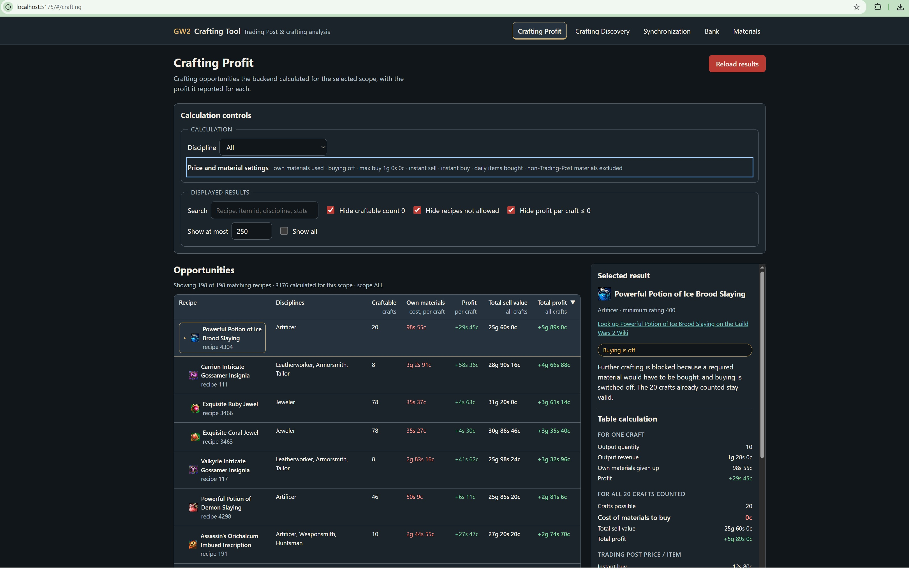
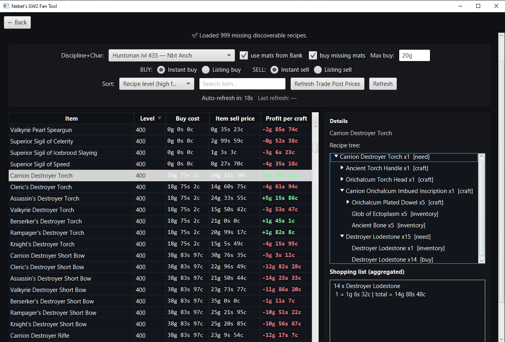
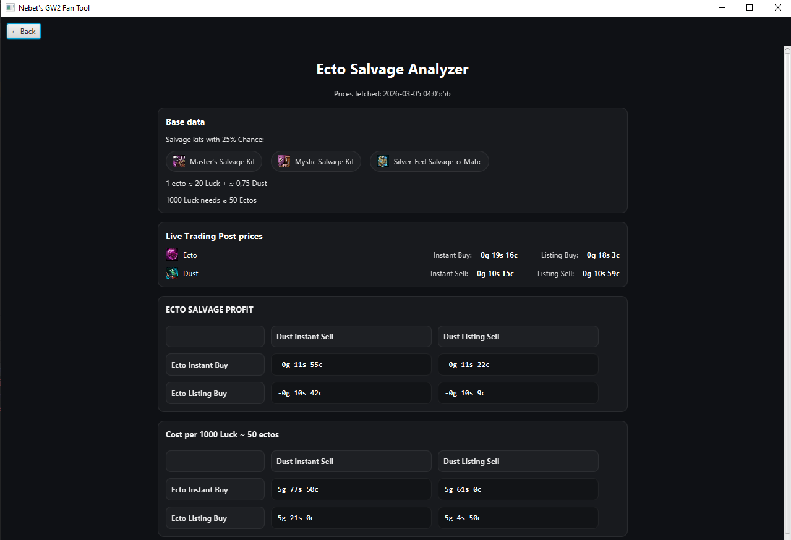

# Nebet's GW2 Crafting Tool


A Guild Wars 2 crafting and economy tool that combines account data, recipe knowledge, owned materials, and Trading Post prices to find useful and profitable crafting opportunities.

> **Active development:** The project is moving quickly, with updates currently landing almost daily. The browser frontend is actively replacing the original JavaFX interface while both continue to use the same backend/domain logic.



## Agentic Software Development Experiment

> **This repository is also a practical experiment in agentic software development.**
>
> Much of the development workflow is driven by an orchestrated AI-agent system that plans work, implements changes, runs targeted verification, uses GitHub CI as the full regression gate, reviews project health, and maintains project documentation.
>
> **[Read about the agentic development experiment and workflow →](agent/agent_README_experimental.md)**

For a player-focused explanation of the crafting calculations, see the **[Crafting Guide](docs/crafting/README.md)**.

---

## What does it do?

The tool is built around a simple question:

> **What can I actually craft for profit with the materials, recipes, and crafting levels my account has?**

It synchronizes Guild Wars 2 data through the official ArenaNet API, stores the relevant state in PostgreSQL, and performs the authoritative calculations in the Java backend.

### Crafting Profit

Find recipes that are useful for the selected account/character scope and compare the value of crafting against the value of the materials involved.

The current web view includes:

- crafting-discipline filtering;
- account/character-aware crafting constraints;
- owned-material and buying settings;
- recipe search and result filtering;
- craftable counts;
- profit per craft and total profit;
- Trading Post values;
- blocked/limited crafting states;
- detailed information for the selected result.

The calculation does more than subtract ingredient prices from output prices. It can recursively evaluate craft-vs-buy decisions and account for owned materials, recipe knowledge, crafting disciplines, character levels, bindings, Trading Post availability, and other domain rules.

### Crafting Discovery

Helps find discoverable recipes appropriate for a character and crafting discipline, including their costs and economic result.



### Account data

The application synchronizes account-specific data used by the crafting calculations, including character crafting disciplines, recipe knowledge, bank/material storage, and character inventories.

Bank and Materials views are already available in the browser frontend.

### Ectoplasm salvage analysis

The project also contains an Ectoplasm Salvage calculator for estimating the effective gold cost of gaining Luck/Magic Find while accounting for the value recovered from salvage results.



---

## Current project status

The project is in an active migration from its original JavaFX desktop interface to a browser-based application.

The major architecture work completed so far includes:

- Maven/JUnit build and test foundation;
- stabilization and isolation of the crafting domain;
- application-service extraction;
- a Spring Boot HTTP API;
- the current Vue/TypeScript browser frontend.

The browser migration is the current major development phase. JavaFX remains in the repository during the migration so functionality can be preserved until web parity is reached.

Planned later phases include:

1. completing browser/frontend parity;
2. multi-user and GW2-account isolation;
3. containerizing the frontend, backend, and PostgreSQL runtime;
4. deployment/runtime configuration;
5. final removal of the superseded JavaFX interface.

See **[ROADMAP.md](docs/ROADMAP.md)** for the detailed sequencing and exit criteria.

---

## Technology stack

### Backend

- **Java 25**
- **Maven**
- **Spring Boot 4.1.1**
- **PostgreSQL**
- **JUnit 5**
- Guild Wars 2 official API

### Frontend

- **Vue 3**
- **TypeScript**
- **Vite**
- **Vitest**
- browser smoke tests using Playwright Core

### Legacy UI during migration

- **JavaFX 25**

JavaFX is intentionally still present while the browser frontend reaches functional parity. It is not the target final UI.

---

## Architecture at a glance

```text
Browser / Vue frontend
        |
        | HTTP
        v
Spring Boot API
        |
        v
Application services
        |
        v
Crafting / economy domain
       / \
      /   \
PostgreSQL  Guild Wars 2 API
```

The backend owns authoritative crafting and economy calculations. The frontend presents backend results rather than independently reimplementing those rules.

The repository contains more detailed architecture and domain documentation under [`docs/`](docs/).

---

## Running locally

The project is still a development build rather than a packaged end-user release.

### Requirements

- Java 25
- PostgreSQL
- Node.js / npm
- a Guild Wars 2 API key for account-specific synchronization

The current local setup still expects the PostgreSQL schema and runtime configuration used by the development environment. See the project documentation and configuration in the repository before running synchronization against a new database.

### 1. Run the backend

From the repository root:

```bash
./mvnw spring-boot:run
```

On Windows PowerShell:

```powershell
.\mvnw.cmd spring-boot:run
```

The backend API is served locally on port `8080` by default.

### 2. Run the frontend

In another terminal:

```bash
cd frontend
npm ci
npm run dev
```

Vite serves the development frontend on port `5173` by default.

Open:

```text
http://localhost:5173
```

During development, the Vite server forwards `/api` requests to the backend.

---

## Testing

### Backend

Run the standard Maven test suite from the repository root:

```bash
./mvnw test
```

Windows PowerShell:

```powershell
.\mvnw.cmd test
```

The project also contains PostgreSQL integration tests and selected optional/live verification paths. See [`docs/TEST_STRATEGY.md`](docs/TEST_STRATEGY.md) for the testing model.

### Frontend

From `frontend/`:

```bash
npm test
npm run type-check
npm run build
```

The frontend also contains browser smoke checks for important flows, layouts, account views, icons, synchronization, and Crafting Profit behavior.

Full pushed changes are verified by the repository's GitHub Actions CI pipeline.

---

## Project documentation

The repository intentionally keeps detailed rules out of this README.

Useful starting points:

- **[Crafting Guide](docs/crafting/README.md)** — plain-language explanation of Crafting Profit / Discovery behavior
- **[Roadmap](docs/ROADMAP.md)** — current development phases and sequencing
- **[Domain Specification](docs/DOMAIN_SPEC.md)** — authoritative crafting/economy rules
- **[Target Architecture](docs/TARGET_ARCHITECTURE.md)** — intended system architecture
- **[Known Problems](docs/KNOWN_PROBLEMS.md)** — currently known unresolved problems and technical debt
- **[Test Strategy](docs/TEST_STRATEGY.md)** — test layers and verification approach
- **[Coding Guidelines](docs/CODING_GUIDELINES.md)** — implementation conventions
- **[Agentic Development Experiment](agent/agent_README_experimental.md)** — AI-agent/orchestrator workflow used to develop the project

---

## Contributing and community

Bug reports, feature ideas, questions, and contributions are welcome.

- Use **GitHub Issues** for reproducible bugs and concrete feature requests.
- Use **GitHub Discussions** for questions, ideas, crafting/economy discussion, and general project feedback.
- Read [`CONTRIBUTING.md`](CONTRIBUTING.md) before submitting code.
- Security-sensitive reports should follow [`SECURITY.md`](SECURITY.md).
- Community participation is covered by [`CODE_OF_CONDUCT.md`](CODE_OF_CONDUCT.md).

The project is changing quickly, so checking the current roadmap and documentation before starting a larger contribution is recommended.

---

## Guild Wars 2 API keys

The current local/single-user development setup can use a locally configured GW2 API key.

The target public multi-user design is different: each user will provide their own key through the browser when account-specific GW2 API access is required. The backend is planned to use it transiently rather than persist the key in the application database.

Guild Wars 2 API keys provide read access according to their granted permissions; they should still not be committed to the repository or posted publicly in issues and logs.

---

## Roadmap highlights

The current intended sequence is:

```text
Build & test foundation              COMPLETE
Domain stabilization                 COMPLETE
Domain isolation                     COMPLETE
Application-service extraction       COMPLETE
Backend HTTP API                     COMPLETE
            |
            v
Frontend migration                   CURRENT
            |
            v
Multi-user / account isolation
            |
            v
PostgreSQL + containerization
            |
            v
Deployment
            |
            v
Final JavaFX removal
```

The roadmap deliberately introduces multi-user/account isolation **before** containerization so deployment is built around the intended shared application model rather than hardening the earlier single-account assumption.

---

## Disclaimer

This is an unofficial community project.

It is **not affiliated with, endorsed by, or sponsored by ArenaNet or NCSOFT**. Guild Wars 2 and related names and assets belong to their respective owners.

The project uses the official Guild Wars 2 API for game/account data where applicable.

## License

This project is licensed under the **MIT License**. See [`LICENSE`](LICENSE).