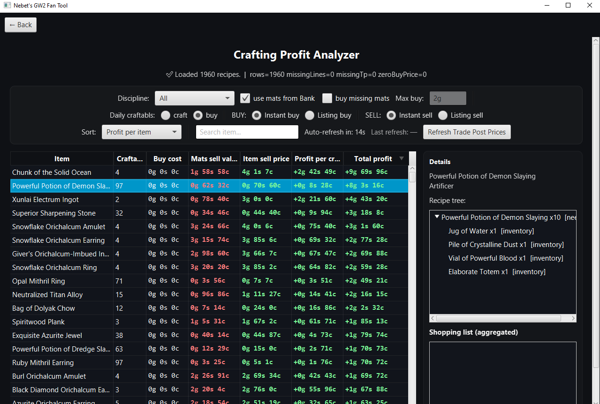

# Nebet's GW2 Tool


A desktop tool that analyzes **Guild Wars 2 crafting profitability** by combining account data, learned recipes, and Trading Post prices to identify profitable crafting opportunities.

The application imports data from the official **Guild Wars 2 API**, stores it in a **PostgreSQL database**, and performs local analysis to determine which recipes can generate profit from the materials you already own.

> This project is being further developed as part of an experiment in Agentic Software Development; see [the experiment documentation](agent/agent_README_experimental.md) for details. For a plain-language explanation of how the Crafting Profit / Crafting Discovery calculation works, see the [crafting guide](docs/crafting/README.md).

---

# Overview

Nebet's GW2 Tool is a Java desktop application designed to help Guild Wars 2 players make better economic decisions by analyzing crafting, materials, and Trading Post prices.

The application connects to the official **Guild Wars 2 API**, stores relevant game data in a **PostgreSQL database**, and performs local calculations to evaluate crafting opportunities and material value across the entire account.

The tool focuses on three main use cases:

- **Crafting Profit Analysis**  
  Identify items that can be crafted from your current materials and determine whether crafting them is more profitable than selling the materials directly.

- **Crafting Discovery Assistance**  
  Help characters efficiently discover new crafting recipes by showing undiscovered recipes, their material costs, and their potential Trading Post value.

- **Economic Calculations for Game Systems**  
  Analyze specific mechanics such as salvaging *Glob of Ectoplasm* to determine the real gold cost of gaining **Magic Find** through Essences of Luck.

By combining account inventory data, recipe knowledge, and Trading Post prices, the tool allows players to convert accumulated materials into profitable crafting outcomes and make informed decisions about how to use their resources.

After the initial synchronization, most analysis is performed **locally**, meaning the application can run quickly and efficiently with only occasional API refreshes required for updated prices or account data.
---

# Technology Stack

- **Language:** Java
- **IDE:** IntelliJ IDEA
- **Database:** PostgreSQL
- **External API:** Guild Wars 2 Official API (ArenaNet)
- **Desktop UI:** JavaFX
- **Browser UI (in progress):** Vue 3 with TypeScript, built by Vite — see *Running the Application*

---

# Database Setup

The project requires a **PostgreSQL database**.

A complete SQL script for creating the database schema is included in the source code:

```
PostgreSQL Query to create DB
```

Run this query in your PostgreSQL environment before starting the application.

---

## Dependencies 

This project currently does not use Gradle or Maven. Dependencies are handled manually.

### Included JARs
The repository includes required third-party JARs in `lib/`:

- Jackson (`jackson-core`, `jackson-databind`, `jackson-annotations`)
- PostgreSQL JDBC driver

### JavaFX (Required)
JavaFX is **not** committed to the repository due to size.

1. Download the JavaFX SDK (matching your platform)
2. In IntelliJ: **File → Project Structure → Libraries → +** and add the JavaFX `lib/` folder
3. Add VM options (Run Configuration):
```
   --module-path "C:[PATH TO YOUR PROJECT ROOT]\lib\javafx-sdk-25.0.2\lib" --add-modules javafx.controls,javafx.fxml 
```
---

# Configuration

To use the GW2 API you must provide your **ArenaNet API key**.

Open the following file:

```
src/repo/AppConfig
```

Configure:

- Your **GW2 API Key**
- PostgreSQL **database URL**
- PostgreSQL **username**
- PostgreSQL **password**

Example configuration parameters are already present in the file.

---

# First-Time Initialization

After starting the application you will see a button on the start screen:

```
First-time DB Setup (Base Fill)
```

This process will:

- Download the full item catalog
- Download all discoverable crafting recipes
- Import account data
- Populate the database tables

⚠️ This step can take **a long time** because it builds the full dataset required for the application.

However it only needs to be executed **once for initial setup**.

---

# Running the Application

After the database has been initialized, the application can be used normally.

The tool allows you to:

- Sync account data
- Sync tradable items (only needed if new items are introduced to the game)
- Refresh Trading Post prices
- Analyze crafting profitability
- Discover new crafting opportunities

## Desktop (JavaFX)

The JavaFX application remains the complete interface and is unchanged. Start it as before.

## Browser (in progress)

A browser client is being built alongside the desktop application; it does not replace it. It has a
dark, responsive application shell with four pages, each reachable from the header and by its own
address (so Back, Forward and bookmarks work): **Crafting Profit** — scope, search and settings on
one side, a short comparison table of recipe, disciplines, craftable count, profit per craft, total
profit and state on the other, and the chosen recipe's full detail beside the table on a wide screen
or below it on a phone — **Synchronization**, whose buttons start the same
account, game-data and Trading Post refresh operations as the desktop buttons and then follow each
task ("Accepted, waiting to start", "Running", "Completed", "Failed", with the task id and timestamps
under "Technical details") — and read-only **Bank** and **Materials** pages showing your stored bank
slots (empty ones included, in place) and material storage as the backend groups them. Those two
pages identify items by item id and show no icon image — the backend supplies no item name, and the
icon it knows about is a file on the backend machine, not something the browser can load.

Choosing a recipe opens its details — revenue, costs and profit under whether they are for one craft
or for every craft counted, the output item's Trading Post quote, and the materials the calculation
said still have to be bought. The step-by-step crafting tree is **not** there yet: the backend has no
route that supplies one, and the page says so rather than guessing at one. That tree and the other
views are desktop-only for now.

Moving between pages keeps your crafting selection and any synchronization still being followed, and
never re-submits anything. A page reload starts fresh: nothing is stored in the browser, so a task
started before the reload keeps running in the backend but can no longer be followed here.

It needs Node.js and two processes, started in this order:

```bash
# 1. backend HTTP API (repository root) — serves http://localhost:8080
./mvnw spring-boot:run

# 2. frontend dev server (frontend/) — serves http://localhost:5173
cd frontend
npm ci
npm run dev
```

Then open <http://localhost:5173>.

After updating backend code, restart the backend as well as refreshing the browser. Vite updates
the frontend without updating an already running Java process. A blank Profit total sell value,
a generic 404 from `/api/crafting/profit/resolution`, and a non-Trading-Post checkbox that resets
together indicate an incompatible backend: inspect the response for `totalSellValueCopper` and
`settings.allowNonTradeableMaterials`, then rebuild/restart the backend serving that origin.
`npm run smoke:profit:live` checks these contracts against the running application and fails if
they are missing. It needs retained real data with an available multi-output, multi-craft recipe;
it does not start synchronization.

The dev server forwards `/api` to the backend, so the browser talks to one origin only. Point it at
a different backend with `GW2_BACKEND_ORIGIN`, and change its own port with `GW2_FRONTEND_PORT`.
The browser never receives your GW2 API key or database credentials — those stay with the backend,
exactly as they do for the desktop application, and the frontend needs no configuration of its own.

Other commands, all run in `frontend/`:

| Command | Purpose |
|---|---|
| `npm run build` | type-check and build the production assets into `frontend/dist/` |
| `npm run type-check` | strict TypeScript check |
| `npm test` | component and unit tests |
| `npm run smoke:browser` | drive a real browser against a running backend (both processes above must already be up) |
| `npm run smoke:profit:live` | strictly check gross totals, selected resolution, non-TP toggles and reloads against a running backend |
| `npm run smoke:sync` | drive a real browser over the synchronization page against a stub backend the script runs itself — needs `npm run build` first, starts no real synchronization |
| `npm run smoke:layout` | drive a real browser over all four pages at desktop, tablet and phone widths, checking navigation, zoom, keyboard focus and contrast against a stub backend — needs `npm run build` first |
| `npm run smoke:profit` | drive a real browser over Crafting Profit, checking the results/detail split at desktop and phone widths and keyboard result selection against a stub backend — needs `npm run build` first |
| `npm run smoke:account` | drive a real browser over the Bank and Materials views against a running backend and compare what is shown with the API responses (both processes above must already be up; reads only) |

---

# Features

## Crafting Profit View



This view answers the core question of the application:

> *"What can I craft with my current materials that is more profitable than selling the materials directly?"*

The user can filter results by:

- **All crafting disciplines**
- A **specific crafting discipline**
- A **specific character + discipline**

For every craftable recipe the table displays:

- **Material sell value** (total Trading Post value of required ingredients)
- **Item sell price** (Trading Post sell value of the crafted item)
- **Profit per craft**

```
profit_per_craft = item_sell_price - materials_sell_value
```

- **Craftable count** (how many times the recipe can be crafted with available materials)
- **Total profit**

```
total_profit = craftable_count × profit_per_craft
```

### Practical Use

Many crafting results appear unprofitable when viewed individually.

However, while playing the game large quantities of common materials accumulate over time (for example wood, ore, cabbage, etc.).

Even if the profit per craft is small, being able to craft **dozens or hundreds of items** can turn those materials into a significant amount of gold.

Example situations:

- crafting potions with cheap materials
- converting excess harvesting materials into gold
- clearing large stacks of bank materials

The Crafting Profit View helps identify these opportunities and convert **unused material stockpiles into profitable items**.

---

## Crafting Discover Helper


This view helps players discover new crafting recipes efficiently.

The user selects:

- a **character**
- a **crafting discipline**

The tool then lists all recipes that:

- can be discovered by combining materials
- are **not learned yet** by the selected character
- are **not vendor-learned recipes** (scroll recipes are excluded)

For each discoverable recipe the tool shows:

- cost of potentially missing materials
- expected Trading Post sell value of the crafted item
- profit per craft (sell value − material cost)

Additional behavior:

- Recipes never exceed the **current crafting level** of the selected character.
- Recipes close to the character’s crafting level give the most **XP for leveling**.

The list can be sorted by:

- item sell price
- crafting profit

This allows the user to either:

- level crafting efficiently
- or search for profitable discoveries.

---

## Salvage Ecto for Dust & Luck


This tool estimates the **real gold cost of increasing Magic Find** by salvaging *Glob of Ectoplasm*.

Salvaging ectos produces:

- Essences of Luck (used to increase Magic Find)
- Crystalline Dust

The tool uses:

- current Trading Post prices
- user-tested drop rate estimates

to calculate:

- the **expected gold loss per salvaged ecto**
- the **effective cost to obtain 1000 Luck**

Prices on this view are always based on **fresh Trading Post prices** that are fetched when the page is opened.

---

## Important Notes About Account Materials

For calculation purposes the application treats **all materials across the account as one combined pool**.

This includes:

- materials stored in the **bank**
- materials stored in **character inventories**

Because of this:

- the tool may assume materials are available even if they are stored on a different character.

Example:

If one character holds 500 wood in their inventory but the bank is empty, the application will still assume that **500 wood are available for crafting calculations**.

However, the in-game crafting interface may not allow crafting until those materials are moved to the correct location.

---

## API Synchronization Delay

After performing actions in-game such as:

- discovering recipes
- consuming materials

it may take **several minutes** until the Guild Wars 2 API reflects those changes.

During that time the application may temporarily display outdated data.

---

# Known Limitations

## Guild Wars 2 API Request Limits

The Guild Wars 2 API applies request limits to API endpoints.

To stay within those limits and keep synchronization fast and reliable, the application intentionally **does not fetch Trading Post prices for every possible item**.

Instead, the application only requests prices for **items that are relevant to the currently used view**.

This design dramatically reduces API load and prevents common issues such as:

- API rate limiting (HTTP 429)
- slow refresh times
- unnecessary requests for items that are never used in calculations

---

## Different TP Refresh Behavior Per View

The **"Refresh TP Prices"** button behaves differently depending on which view it is used in.

### Crafting Profit View

When refreshing prices in the Crafting Profit view, the application fetches prices only for:

- recipe outputs that can be crafted with the account
- ingredients required for those recipes

This keeps the refresh small and fast because it only updates prices that are relevant for profit calculations.

### Crafting Discovery Helper

The discovery view potentially needs data for a **much larger set of recipes**, because it analyzes recipes that have **not yet been discovered**.

As a result, a TP refresh in the discovery helper may request significantly more prices than in the profit view.

Even in this case, the application still filters the request set to avoid unnecessary API calls.

---

## Manual Price Refresh

Trading Post prices are refreshed **manually** using the refresh button.

Prices may therefore be several minutes old, which is generally acceptable because GW2 Trading Post prices usually do not change dramatically in very short timeframes.

---

# Future Improvements

## Frontend / UI Direction

The first web frontend should provide a modern, clear, and user-friendly replacement for the existing JavaFX interface.

The initial goal is **not** to design the final product UI. The first version should establish a usable web interface that exposes the functionality and information already available in the JavaFX application in a more approachable layout.

### First Web Version

The first version should:

* support a single primary user;
* reproduce the useful information and functionality currently available through the JavaFX UI;
* reorganize that information where necessary to improve usability rather than copying the JavaFX layout exactly;
* use a modern but relatively simple visual design;
* make important actions, results, filters, status information, and calculation explanations easy to find;
* avoid unnecessary visual or interaction complexity;
* provide a good foundation for later Product Owner-driven UI development.

The JavaFX interface is therefore a **functional reference**, not a visual specification.

The web frontend may improve grouping, navigation, presentation, terminology, and interaction patterns as long as documented product/domain behavior remains unchanged.

### Design Reference

Existing Guild Wars 2 crafting/economy tools and similar applications may be used as reference material for:

* common information layouts;
* navigation patterns;
* result tables;
* filtering;
* recipe/crafting presentation;
* economic data presentation;
* generally useful UX conventions.

These products are references only. Their behavior, architecture, or design should not automatically become project requirements.

### Future User Model

The first version is intended primarily for a single user.

The architecture should not unnecessarily prevent a later version from supporting multiple users, but multi-user functionality must not be implemented speculatively.

A possible future model may allow individual users to provide and retain their own Guild Wars 2 API key without requiring a traditional username/password login.

For such a model, the API key may be retained through browser-associated state such as a secure cookie or an equivalent mechanism. The exact security, storage, session, and account-isolation design is intentionally **TBD** and must be decided before multi-user support is implemented.

### Future UI Evolution

The first web UI is a functional and visual starting point, not the final interface.

Additional functionality, workflows, screens, and UX requirements will be introduced by the Product Owner as development reaches those areas.

The final UI structure and visual design should therefore evolve through Product Owner requirements and actual usage rather than being fully specified in advance.

Until then, prefer:

* simple navigation;
* understandable layouts;
* modern but restrained visual design;
* clear presentation of calculation results;
* visible loading/error/blocked states;
* sensible defaults;
* minimal unnecessary interaction steps;
* reusable frontend patterns that can evolve without requiring a complete redesign.

---

# Disclaimer

This project is not affiliated with or endorsed by ArenaNet or NCSoft.
Guild Wars 2 and all associated trademarks are property of ArenaNet.

## License

This project is licensed under the MIT License - see the LICENSE file for details.