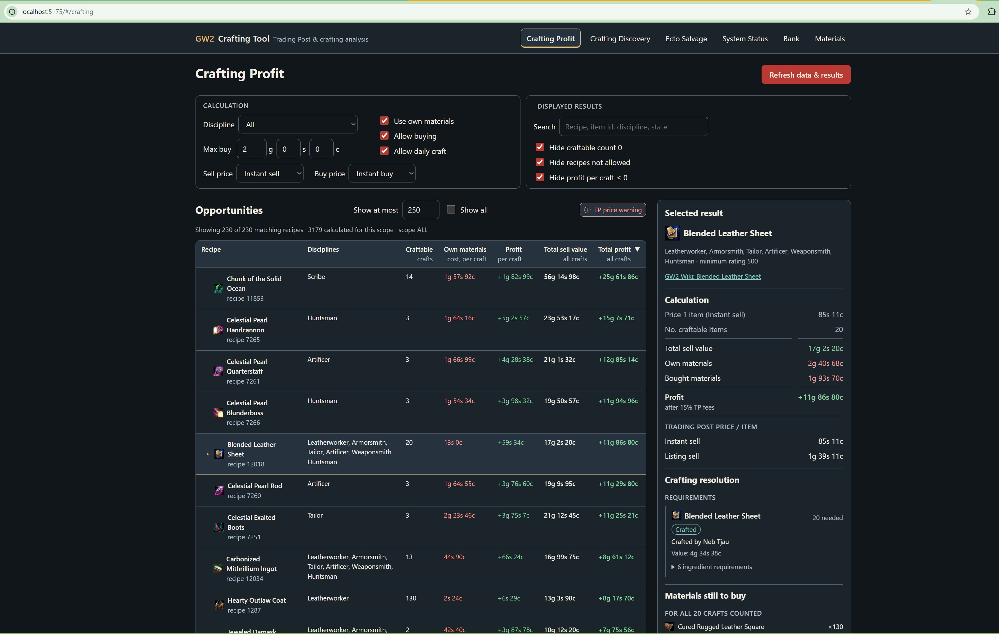
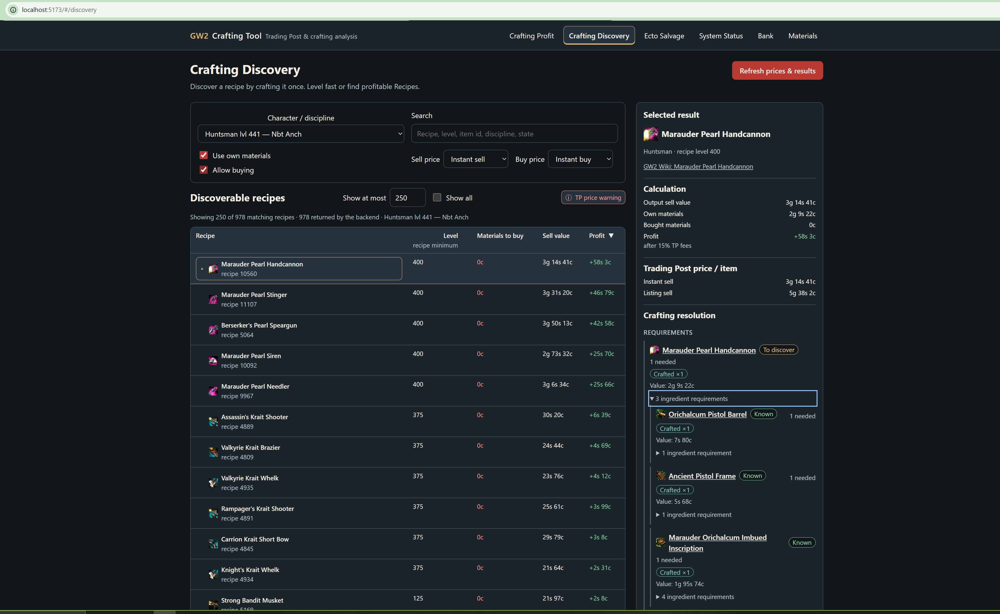
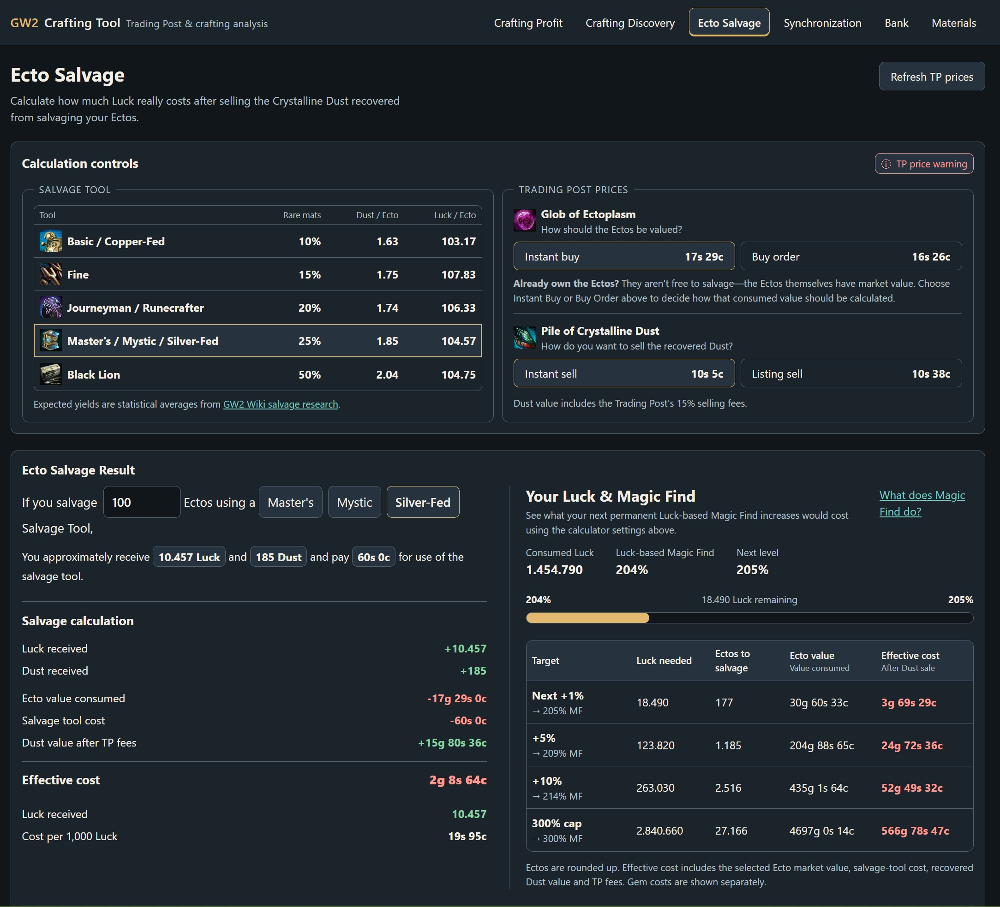

# Nebet's GW2 Crafting Tool


**Turn the materials and recipes you already have into useful crafting opportunities.** Nebet's GW2 Crafting Tool combines your Guild Wars 2 account data, recipe knowledge, inventory and Trading Post prices to help you discover recipes, evaluate crafting profit and plan which materials to use, craft or buy.

> **Development note:** This project is also an experiment in AI-assisted, agentic software development. An orchestrated agent workflow helps plan, implement, review and verify changes. The development process is documented separately in the [Agentic Development Experiment](agent/agent_README_experimental.md); the rest of this README is about the application.



## Features

### Crafting Profit

Find profitable crafting opportunities based on your account's materials, known recipes and available crafting disciplines. The calculator evaluates materials you own at their economic value, considers buying versus recursively crafting ingredients and accounts for Trading Post selling fees.

- Choose a crafting discipline or character-specific scope.
- Configure owned-material usage, buying, price modes and applicable crafting restrictions.
- Search, filter and sort by profit per craft, total profit, craftable quantity and other useful values.
- Compare the value of selling raw materials with the result of crafting them into finished items.
- Inspect a selected recipe's costs, Trading Post prices, ingredient-resolution tree and shopping list, including quantities and purchase costs.
- Follow item-specific GW2 Wiki links for ingredients that need further investigation.

**Profit per craft** helps identify an efficient recipe; **total profit** highlights opportunities to turn larger quantities of materials into gold. Less obvious recipes can be worthwhile when you already have enough materials for many crafts.


### Crafting Discovery

Find recipes your selected character can learn through normal crafting discovery, taking their discipline, current crafting level and the account's existing recipe knowledge into account. **Each result evaluates one discovery attempt**, including recipes that produce more than one output item.

- Compare the material cost, potential output value and profit or loss of a single discovery.
- Use owned ingredients, known crafting recipes, discoverable intermediate recipes and permitted Trading Post purchases when planning the required materials.
- See which sub-recipes are already known and which need to be discovered first.
- Inspect the recursive ingredient tree and the materials still needed or to buy.
- Open item-specific Wiki links when a material needs an alternative acquisition method.

Discovery stays focused on recipes learned through normal discovery; it is not a catalogue of every recipe or acquisition method in Guild Wars 2.



### Ectoplasm Salvage & Luck

Estimate the cost of salvaging Globs of Ectoplasm for Luck, accounting for the expected value of recovered Crystalline Dust and Trading Post fees.

- View your account's current Luck and Magic Find information.
- Choose the salvage tool and compare its cost against the expected salvage outcome.
- Configure the relevant Trading Post buy and sell prices.
- Calculate expected effective gold costs and explore Luck targets.

Salvage results are modeled using expected yields, rather than guaranteed drops.



### Account, Bank & Materials

The application synchronizes account data from the official Guild Wars 2 API, including character crafting disciplines and levels, known recipes, character inventories, bank contents and material storage. Dedicated Bank and Materials views make those resources accessible in the browser.

### System Status

A dedicated System Status page shows the state of account synchronization, global game data and the shared Trading Post price cache. It also provides manual account and global-data refresh actions. The page is intended to grow into an administration interface as the project expands.

Crafting Profit's **Refresh data & results** action refreshes the relevant account data, updates missing or older Trading Post quotes as needed, and recalculates the results. Global game data is also checked automatically in the background.

## How the calculations work

Crafting calculations run in the Java backend. Depending on the selected view and settings, they account for:

- owned materials and their opportunity cost;
- known and eligible recipes, crafting disciplines and character restrictions;
- recursive ingredient crafting and craft-versus-buy decisions;
- Trading Post quotes and the selected buy/sell price modes;
- output quantities, purchase costs and Trading Post selling fees;
- binding rules and applicable daily-crafting restrictions.

The crafting-resolution tree explains how each requirement is supplied: from inventory, by crafting, through a Trading Post purchase or through a combination of methods. Missing or otherwise unobtainable ingredients remain visible with their quantities and Wiki links.

For more detail, see the [Crafting Guide](docs/crafting/README.md), [Crafting Glossary](docs/crafting/GLOSSARY.md) and [Domain Specification](docs/DOMAIN_SPEC.md).

## Project status and roadmap

**The Vue/TypeScript web frontend has replaced JavaFX as the application's interface.** Crafting Profit, Crafting Discovery, Ectoplasm Salvage, account views and System Status are available in the browser. The project remains under active development and is not yet a packaged public multi-user service.

Planned work includes multi-user and GW2-account isolation, containerized deployment of the application and PostgreSQL, deployment configuration and further improvements to the existing views. System Status is planned to evolve into an admin page.

See the [Roadmap](docs/ROADMAP.md) for detailed priorities and progress.

## Technology stack

| Layer | Technology |
| --- | --- |
| Frontend | Vue 3, TypeScript, Vite |
| Backend | Java 25, Spring Boot 4.1.1, Maven |
| Database | PostgreSQL |
| Game and account data | Official Guild Wars 2 API |
| Testing | JUnit 5, Vitest, Playwright Core browser smoke tests |

The frontend communicates with the Spring Boot API over HTTP. Application services coordinate data access and calculations, while the crafting and economy domain owns the calculation rules. PostgreSQL stores synchronized data and the price cache.

## Running locally

The project currently uses a development-oriented, single-user setup rather than a packaged release.

**Requirements:** Java 25, PostgreSQL, Node.js/npm and a Guild Wars 2 API key with the permissions required for account synchronization. The PostgreSQL schema and runtime configuration must be set up for your environment; consult the repository configuration and development documentation.

**1. Start the backend** from the repository root:

```bash
./mvnw spring-boot:run
```

On Windows PowerShell:

```powershell
.\mvnw.cmd spring-boot:run
```

The backend API runs on port `8080` by default.

**2. Start the frontend** in a second terminal:

```bash
cd frontend
npm ci
npm run dev
```

Open **http://localhost:5173**. During development, Vite forwards `/api` requests to the backend.

## Testing

Run backend tests from the repository root:

```bash
./mvnw test
```

Run frontend checks from `frontend/`:

```bash
npm test
npm run type-check
npm run build
```

The repository also includes integration tests and browser smoke checks. See the [Test Strategy](docs/TEST_STRATEGY.md) for coverage and verification details.

## Documentation

- [Crafting Guide](docs/crafting/README.md) — player-focused explanation of crafting calculations and views.
- [Crafting Glossary](docs/crafting/GLOSSARY.md) — terminology and UI labels.
- [Crafting Status Reference](docs/CRAFTING_STATUS_REFERENCE.md) — developer reference for crafting states and blocking reasons.
- [Roadmap](docs/ROADMAP.md) — planned application work.
- [Domain Specification](docs/DOMAIN_SPEC.md) — authoritative crafting and economy rules.
- [Current State](docs/CURRENT_STATE_SPEC.md) — implemented behavior and limitations.
- [Architecture](docs/CURRENT_ARCHITECTURE.md) — current application structure.
- [Known Problems](docs/KNOWN_PROBLEMS.md) — open defects and limitations.

## Contributing and community

Bug reports, feature requests and contributions are welcome. Use [GitHub Issues](https://github.com/Nebettadjsr/GW2/issues) for bugs and concrete requests, and [GitHub Discussions](https://github.com/Nebettadjsr/GW2/discussions) for questions and ideas. See [Contributing](CONTRIBUTING.md), [Security](SECURITY.md) and the [Code of Conduct](CODE_OF_CONDUCT.md).

## Guild Wars 2 API keys

The current local setup uses a locally configured API key. The planned multi-user application will accept each user's key for account-specific access and use it transiently rather than storing it in the application database. Do not commit API keys to the repository or include them in public bug reports.

## Disclaimer

This is an unofficial community project, **not affiliated with, endorsed by or sponsored by ArenaNet or NCSOFT**. Guild Wars 2 and related names and assets belong to their respective owners. The application uses the official Guild Wars 2 API where applicable.

## License

Licensed under the [MIT License](LICENSE).